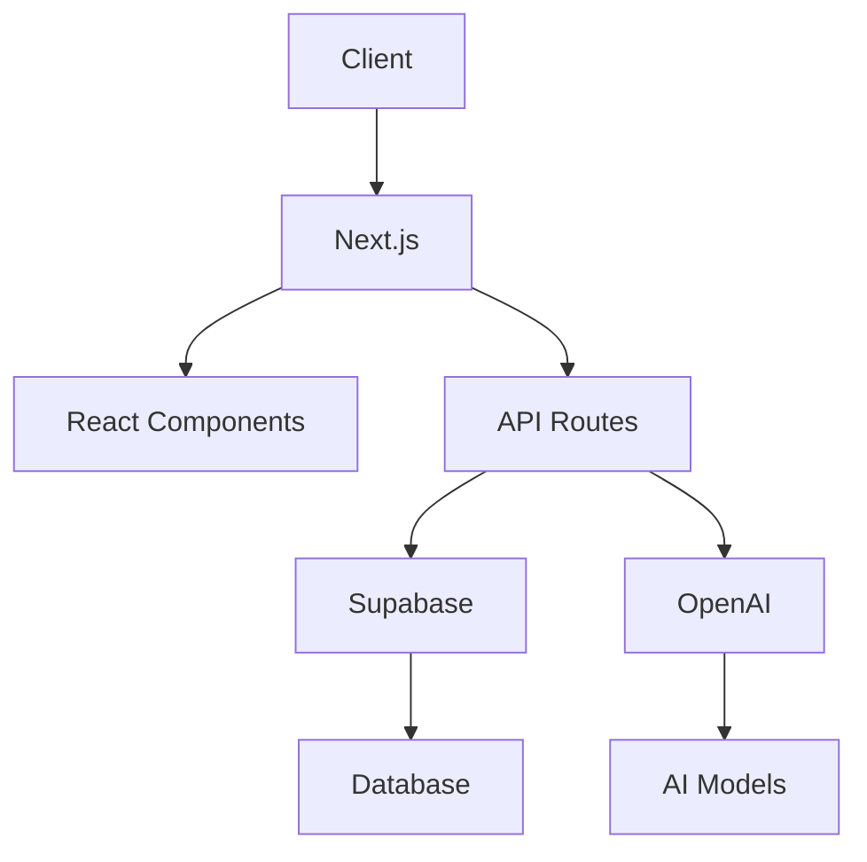

# Documentation du Projet AI Chatbot

## Table des Matières

1. [Vue d'ensemble du projet](#vue-densemble-du-projet)
2. [Architecture technique](#architecture-technique)
3. [Instructions de configuration](#instructions-de-configuration)
4. [Dépendances et prérequis](#dépendances-et-prérequis)
5. [Configuration](#configuration)
6. [Documentation de l'API](#documentation-de-lapi)
7. [Cas d'utilisation courants](#cas-dutilisation-courants)
8. [Guide de dépannage](#guide-de-dépannage)
9. [Considérations de sécurité](#considérations-de-sécurité)
10. [Optimisations de performance](#optimisations-de-performance)
11. [Lignes directrices pour les tests](#lignes-directrices-pour-les-tests)
12. [Processus de déploiement](#processus-de-déploiement)
13. [Procédures de maintenance](#procédures-de-maintenance)
14. [Informations de contact](#informations-de-contact)

---

## Vue d'ensemble du projet

Le projet **AI Chatbot** est une application web développée avec Next.js, React, et Supabase. Elle permet aux utilisateurs de gérer et d'interagir avec des chats via une interface utilisateur intuitive. Le projet utilise des technologies modernes pour offrir une expérience utilisateur fluide et sécurisée.

---

## Architecture technique

### Diagramme de l'architecture



### Modèles de conception et décisions architecturales

- **Next.js** : Utilisé pour le rendu côté serveur et les fonctionnalités de l'API.
- **React** : Utilisé pour la construction des composants UI.
- **Supabase** : Utilisé pour l'authentification et la gestion de la base de données.
- **OpenAI** : Utilisé pour les interactions avec les modèles de langage.

### API et interfaces

#### API Routes

- **`/api/auth/callback`** : Gère le callback d'authentification.
- **`/api/chat`** : Gère les interactions avec les chats.

#### Interfaces

- **`SidebarList`** : Affiche la liste des chats.
- **`Sidebar`** : Composant de la barre latérale.
- **`ChatPanel`** : Gère l'interface de chat.

### Exemples de code

```typescript
// Exemple de composant React
import { useState, useEffect } from 'react';

const ChatPanel = ({ initialMessages }) => {
    const [messages, setMessages] = useState(initialMessages);

    useEffect(() => {
        // Logique de chargement des messages
    }, []);

    return (
        <div>
            {messages.map((msg, index) => (
                <div key={index}>{msg}</div>
            ))}
        </div>
    );
};

export default ChatPanel;
```

### Options de configuration

- **`.env.example`** : Fichier de configuration des variables d'environnement.
- **`next.config.js`** : Configuration de Next.js.

---

## Instructions de configuration

### Prérequis

- **Node.js** : Version 14 ou supérieure.
- **npm** ou **yarn** : Gestionnaire de paquets.
- **Supabase** : Compte et projet configurés.
- **OpenAI** : Clé API.

### Étapes de configuration

1. **Cloner le dépôt** :
    ```bash
    git clone <repository-url>
    cd <repository-directory>
    ```

2. **Installer les dépendances** :
    ```bash
    npm install
    # ou
    yarn install
    ```

3. **Configurer les variables d'environnement** :
    - Copier `.env.example` en `.env`.
    - Remplir les valeurs nécessaires.

4. **Lancer l'application** :
    ```bash
    npm run dev
    # ou
    yarn dev
    ```

---

## Dépendances et prérequis

### Tableau des dépendances

| Dépendance       | Version   | Description                          |
|------------------|-----------|--------------------------------------|
| `next`          | 12.0.7    | Framework React pour le rendu côté serveur |
| `react`         | 17.0.2    | Bibliothèque JavaScript pour l'interface utilisateur |
| `supabase`      | 1.0.0     | Service de base de données et d'authentification |
| `openai`        | 1.0.0     | API pour les modèles de langage |
| `tailwindcss`   | 2.2.19    | Framework CSS utilitaire |

### Prérequis

- **Node.js** : Version 14 ou supérieure.
- **npm** ou **yarn** : Gestionnaire de paquets.
- **Supabase** : Compte et projet configurés.
- **OpenAI** : Clé API.

---

## Configuration

### Fichiers de configuration

- **`.env`** : Variables d'environnement.
- **`next.config.js`** : Configuration de Next.js.
- **`tailwind.config.js`** : Configuration de Tailwind CSS.

### Exemple de configuration

```javascript
// next.config.js
module.exports = {
    reactStrictMode: true,
    experimental: {
        serverActions: true,
    },
    images: {
        remotePatterns: [
            {
                protocol: 'https',
                hostname: 'githubusercontent.com',
            },
        ],
    },
};
```

---

## Documentation de l'API

### Endpoints

- **`/api/auth/callback`** : Gère le callback d'authentification.
- **`/api/chat`** : Gère les interactions avec les chats.

### Exemple de requête

```http
POST /api/chat
Content-Type: application/json

{
    "message": "Bonjour, comment puis-je vous aider?"
}
```

### Réponse

```json
{
    "response": "Bonjour! Je suis là pour vous aider."
}
```

---

## Cas d'utilisation courants

### Authentification

1. **Connexion** : Utilisateur se connecte via GitHub OAuth.
2. **Session** : Session gérée par Supabase.

### Interaction avec les chats

1. **Affichage des chats** : Utilisateur voit la liste des chats.
2. **Création de chat** : Utilisateur peut créer un nouveau chat.
3. **Suppression de chat** : Utilisateur peut supprimer un chat.

---

## Guide de dépannage

### Problèmes courants

- **Erreur de connexion** : Vérifiez les variables d'environnement.
- **Problème de rendu** : Vérifiez les logs du serveur.

### Solutions

- **Erreur de connexion** : Assurez-vous que les clés API sont correctes.
- **Problème de rendu** : Vérifiez les dépendances et les configurations.

---

## Considérations de sécurité

### Bonnes pratiques

- **Gestion des clés API** : Ne jamais exposer les clés API.
- **Authentification** : Utiliser Supabase pour l'authentification sécurisée.
- **Validation des entrées** : Toujours valider les entrées utilisateur.

### Exemple de code sécurisé

```typescript
// Exemple de validation des entrées
const validateInput = (input) => {
    if (typeof input !== 'string' || input.length > 100) {
        throw new Error('Invalid input');
    }
    return input;
};
```

---

## Optimisations de performance

### Conseils

- **Utiliser le rendu côté serveur** : Pour améliorer les temps de chargement.
- **Optimiser les images** : Utiliser des formats d'image modernes.
- **Mettre en cache les données** : Utiliser des stratégies de mise en cache.

### Exemple de code

```javascript
// next.config.js
module.exports = {
    images: {
        remotePatterns: [
            {
                protocol: 'https',
                hostname: 'githubusercontent.com',
            },
        ],
    },
};
```

---

## Lignes directrices pour les tests

### Types de tests

- **Tests unitaires** : Pour les composants individuels.
- **Tests d'intégration** : Pour les interactions entre composants.
- **Tests end-to-end** : Pour l'expérience utilisateur complète.

### Exemple de test

```javascript
// Exemple de test unitaire avec Jest
import { render, screen } from '@testing-library/react';
import ChatPanel from '../components/ChatPanel';

test('renders chat panel', () => {
    render(<ChatPanel initialMessages={[]} />);
    expect(screen.getByText('Chat Panel')).toBeInTheDocument();
});
```

---

## Processus de déploiement

### Étapes de déploiement

1. **Build** : Construire l'application.
    ```bash
    npm run build
    # ou
    yarn build
    ```

2. **Déploiement** : Déployer sur Vercel.
    ```bash
    vercel --prod
    ```

3. **Vérification** : Vérifier le déploiement.

### Exemple de script de déploiement

```bash
#!/bin/bash
npm run build
vercel --prod
```

---

## Procédures de maintenance

### Mises à jour

- **Mettre à jour les dépendances** : Régulièrement.
- **Corriger les bugs** : Suivre les rapports de bugs.

### Surveillance

- **Logs** : Surveiller les logs pour les erreurs.
- **Performance** : Surveiller les temps de réponse.

### Sauvegarde et récupération

- **Sauvegardes régulières** : De la base de données.
- **Procédures de récupération** : Tester régulièrement.

### Tâches de maintenance

- **Nettoyage des données** : Supprimer les données obsolètes.
- **Mises à jour de sécurité** : Appliquer les correctifs de sécurité.

---

## Informations de contact

### Contributeurs

- **Nom** : [Nom du contributeur]
- **Email** : [Email du contributeur]

### Lignes directrices pour les contributions

1. **Forker le dépôt** : Créez une branche pour vos modifications.
2. **Créer une Pull Request** : Décrivez les modifications apportées.
3. **Revue de code** : Attendez la revue de code et les commentaires.

### Liens utiles

- [Documentation officielle de Next.js](https://nextjs.org/docs)
- [Documentation de Supabase](https://supabase.io/docs)
- [Documentation d'OpenAI](https://beta.openai.com/docs)

---

**Note** : Cette documentation est un guide complet pour le projet AI Chatbot. Pour toute question ou assistance supplémentaire, veuillez contacter les contributeurs listés ci-dessus.
